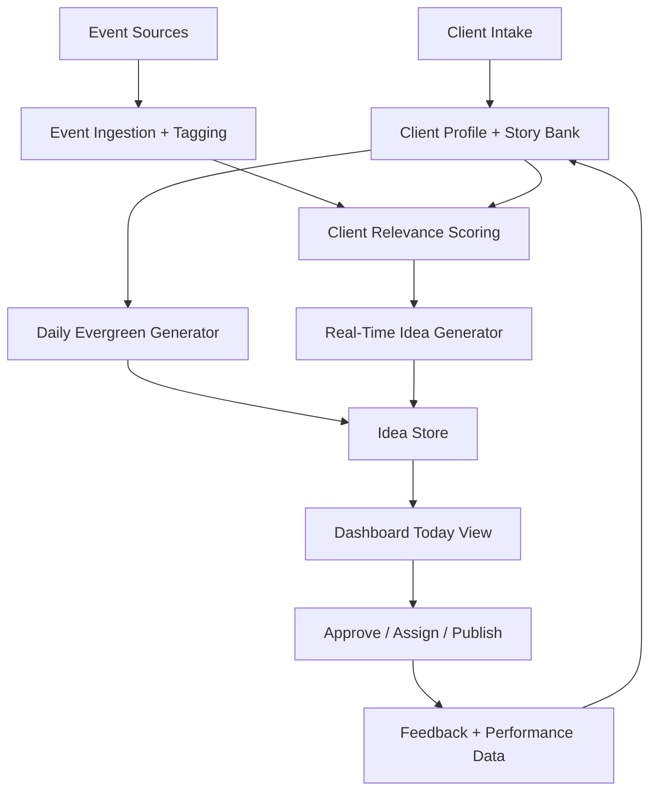

# 1000media Content Ideas Dashboard MVP

## 1. Product goal

Build one internal dashboard for everyone at `1000media.com` where a teammate can:

1. sign in with company access
2. select a client
3. see high-quality content ideas for today
4. understand why each idea matters
5. move from idea to content brief quickly

The output mix should be:

- `50% evergreen human content`
- `50% relevant real-time event content`

The system should not just generate random prompts. It should generate ideas that are:

- tied to the client's audience
- tied to the client's brand voice
- tied to known people stories, customer stories, and employee stories
- tied to real events that are actually relevant to that client
- fresh enough to publish quickly

## 2. What the dashboard should show

For each client, the main dashboard should have five views:

### Today

The default view. Show the top daily ideas in two columns:

- `Evergreen / Human`
- `Real-Time / Event`

Each idea card should include:

- title
- hook
- angle
- recommended format (`reel`, `carousel`, `tweet thread`, `short video`, etc.)
- target audience
- why this will work
- why now
- script outline or talking points
- CTA
- confidence score
- status (`new`, `approved`, `used`, `ignored`)

### Story Bank

A searchable bank of reusable human-centered inputs:

- customer stories
- founder stories
- employee spotlights
- testimonials
- frequently asked questions
- myths and misconceptions
- behind-the-scenes moments
- company values in action

This is the foundation for evergreen content. If this data is weak, the AI ideas will also be weak.

### Events

A live feed of events the system thinks matter for the client:

- holidays and observances
- cultural moments
- industry news
- product launches
- regulatory changes
- conferences
- seasonal trends
- geo-specific events

Each event should show:

- event name
- event date or timestamp
- source
- relevance score
- matching client tags
- suggested content angles

### Calendar

A simple weekly and monthly view of:

- approved ideas
- assigned owners
- publish dates
- platform targets

### Performance

Track whether the dashboard is actually helping:

- ideas accepted vs ignored
- time from idea to post
- evergreen vs real-time usage
- content performance by idea type
- top hooks and formats
- repeatable winners by client

## 3. The three systems you actually need

This product is really three systems working together.

### A. Client intelligence system

This stores what the AI needs to know about each client.

For each client, capture:

- company summary
- offers and business model
- audience segments
- geography
- industry
- brand voice
- content do's and don'ts
- taboo or sensitive topics
- core human stories
- recurring themes
- priority platforms
- languages
- important seasonal dates
- relevant faith, culture, or community calendars
- competitor handles or keywords

### B. Evergreen content engine

This creates the human-centered half of the feed.

It should pull from the story bank and rotate through durable formats like:

- customer transformation stories
- employee point of view
- founder lessons
- day-in-the-life content
- myths vs truth
- mistakes to avoid
- values in action
- before and after stories
- social proof
- relatable audience pain points

### C. Real-time event engine

This creates the event-driven half of the feed.

It should:

1. ingest events continuously
2. tag events by category, location, audience, and freshness
3. compare them against each client profile
4. generate content angles only when relevance is high enough
5. expire stale ideas quickly

This is where most teams fail. They either react too slowly or they publish low-relevance trend-chasing content. Your system should reward `relevance + speed`, not just "what is trending."

## 4. Recommended architecture

### Web app

- `Next.js App Router`
- internal dashboard UI
- server components for client dashboards
- client components for interactive filters, approvals, and search

Official docs:

- [Next.js App Router](https://nextjs.org/docs/app)
- [Next.js project structure](https://nextjs.org/docs/app/getting-started/project-structure)

### Auth and database

- `Supabase Auth` for employee sign-in
- start with `Google login` for the company if that matches your workspace
- use `Row Level Security` so access can be company-wide now and stricter later if needed
- `Postgres` as the source of truth

Official docs:

- [Supabase Auth](https://supabase.com/docs/guides/auth)
- [Login with Google](https://supabase.com/docs/guides/auth/social-login/auth-google)
- [Supabase Row Level Security](https://supabase.com/docs/guides/database/postgres/row-level-security)

### AI generation

- `OpenAI Responses API` to generate idea cards
- `Structured Outputs` so every idea returns a predictable schema
- `Embeddings` so you can match client context and event relevance instead of relying on prompt text alone

Official docs:

- [OpenAI Responses API](https://platform.openai.com/docs/api-reference/responses/create?api-mode=responses)
- [Structured Outputs](https://platform.openai.com/docs/guides/structured-outputs?lang=javascript)
- [Embeddings guide](https://developers.openai.com/api/docs/guides/embeddings)

### Retrieval and relevance

- `pgvector` in Postgres
- store embeddings for:
  - client profile summaries
  - story bank entries
  - prior winning posts
  - incoming events
- use similarity search to find the best story inputs or the best matching events per client

Official docs:

- [pgvector in Supabase](https://supabase.com/docs/guides/database/extensions/pgvector)

### Scheduled jobs

Use scheduled jobs for:

- morning evergreen generation
- frequent event ingestion
- ranking refreshes
- cleanup of stale real-time ideas

Good options:

- `Supabase Cron` to schedule DB or HTTP jobs
- `Supabase Edge Functions` for fetch + generation tasks

Official docs:

- [Supabase Cron](https://supabase.com/docs/guides/cron)
- [Supabase Edge Functions](https://supabase.com/docs/guides/functions)
- [Supabase Background Tasks](https://supabase.com/docs/guides/functions/background-tasks)

### Deployment

- deploy the dashboard on `Vercel`
- keep database and workers in `Supabase`

Official docs:

- [Next.js on Vercel](https://vercel.com/docs/concepts/next.js/overview)

## 5. Suggested data model

Start with these tables:

- `organizations`
- `users`
- `clients`
- `teams`
- `team_members`
- `client_profiles`
- `story_bank_entries`
- `event_sources`
- `events`
- `content_ideas`
- `idea_sources`
- `idea_feedback`
- `published_posts`

### Minimum fields by table

`clients`

- id
- name
- slug
- industry
- region
- status

`client_profiles`

- client_id
- business_summary
- audience_summary
- brand_voice
- dos
- donts
- taboo_topics
- key_dates
- keywords
- competitor_keywords
- religious_or_cultural_context

`story_bank_entries`

- client_id
- type
- title
- summary
- source_person
- source_link
- tags
- freshness
- usable_platforms

`events`

- source_name
- title
- summary
- occurred_at
- event_date
- geo
- categories
- source_url
- freshness_score
- embedding

`content_ideas`

- client_id
- idea_type
- title
- hook
- angle
- format
- target_platform
- why_it_should_work
- why_now
- script_outline
- cta
- confidence_score
- status
- published_post_id
- generated_at

`idea_feedback`

- idea_id
- user_id
- disposition
- notes
- performance_rating

## 6. End-to-end content generation flow

### Daily evergreen run

For each client, every morning:

1. retrieve the client profile
2. retrieve the most useful story bank entries
3. exclude ideas recently shown or used
4. ask the model for `5 evergreen human ideas`
5. validate output against the JSON schema
6. save ideas

### Real-time run

Every `15 to 30 minutes`:

1. fetch new events from selected sources
2. tag and embed them
3. compare each event to each client profile
4. keep only events above a relevance threshold
5. ask the model for `3 to 5 real-time ideas` per high-match client
6. set short expiration windows on these ideas

### Idea ranking

Rank ideas using a weighted score:

- relevance to client
- freshness
- likely audience resonance
- novelty vs last 30 days
- past performance of similar ideas
- human-editor feedback

## 7. What to collect during client onboarding

Do not skip this. This is where idea quality comes from.

For each client, your team should upload or fill in:

- company description
- product and offer details
- audience personas
- common customer questions
- customer wins
- employee stories
- founder stories
- platform priorities
- tone examples
- forbidden topics
- upcoming campaigns
- annual calendar
- geo and language constraints
- relevant cultural and religious moments
- competitor list

If you do not collect this, the dashboard will produce generic "AI slop."

## 8. Real-time event sources to start with

Start narrow. Do not try to monitor the whole internet on day one.

Start with:

- curated holiday and observance calendars
- industry newsletters and RSS feeds
- a few trusted news sources per client vertical
- manually maintained client-specific watchlists
- internal manual event submissions from account managers

Later, add:

- trend APIs
- competitor monitoring
- transcript ingestion from podcasts or earnings calls
- Google Trends or social listening tools

The first version should optimize for `signal quality`, not source count.

## 9. MVP scope

If you want this built quickly, the MVP should do only this:

1. employee logs in
2. employee selects client
3. dashboard shows today's ideas
4. dashboard includes `5 evergreen` and `5 real-time` ideas
5. idea cards show sources and rationale
6. user can mark `approved`, `used`, or `not useful`
7. admins can edit client profiles and story banks

Avoid building these in v1:

- full social publishing
- full analytics suite
- auto-posting
- complicated approval hierarchies
- too many external data providers

## 10. Recommended build order

### Phase 1: foundation

- set up auth
- create clients, teams, and profiles
- build story bank CRUD
- build basic dashboard shell

### Phase 2: evergreen engine

- create daily idea generation job
- store ideas
- ship the Today view
- collect human feedback

### Phase 3: real-time engine

- ingest event feeds
- score relevance
- generate real-time ideas
- expire low-value or stale items

### Phase 4: learning loop

- connect published posts
- track outcomes
- improve ranking and prompts

## 11. Team roles

Keep ownership simple:

- `Admin`: manages users, clients, and settings
- `Strategist`: edits client profiles, story bank, and idea rules
- `Creator`: consumes ideas and marks outcomes
- `Viewer`: reads ideas only

## 12. Metrics that matter

Measure the system by business outcomes, not demo quality.

- percentage of ideas actually used
- average time from event detection to approved brief
- ratio of evergreen to real-time posts
- average content performance vs pre-dashboard baseline
- number of clients with healthy story banks
- idea rejection reasons

## 13. My recommendation for your first version

If I were building this for you from scratch, I would do this:

1. ship a private internal dashboard with login and client switching
2. force every client through a strong intake process
3. build the evergreen engine first
4. then add a narrow real-time event engine with curated feeds
5. collect feedback for two to four weeks before making it more automatic

That path gives you something useful fast, while avoiding the common trap of building a complicated trend detector that has no real client context.
